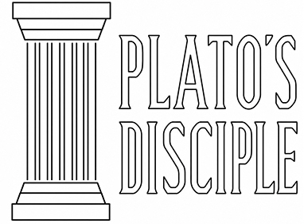

<p align="center">
  
</p>

# Plato's Disciple

Plato's Disciple is a local-first desktop agent for searching and chatting with a private document knowledge base. It carries forward the proven model of traditional full-text search—indexing the contents of local documents (XLSX, DOCX, PDF, PPT/PPTX, HTML, and more)—while bringing a Google-like search experience to your own document collection.

Use it in two complementary ways: **Classic Search** provides fast full-text keyword results with highlighted excerpts, while **AI Conversation** uses Azure OpenAI and retrieval-augmented generation (RAG) to let you ask questions about your documents in natural language—much like using ChatGPT—and receive grounded answers in the language of your choice. Your source documents, search index, and PostgreSQL database remain locally stored and under your control; only your question and the selected document context required for AI processing are sent to your configured Azure OpenAI service.

## Features

- Local document ingestion and local PostgreSQL storage
- ChatGPT-like conversations grounded in your private documents through scoped retrieval-augmented generation (RAG)
- Google-like full-text keyword search with highlighted document excerpts
- Incremental scanning: unchanged files are skipped and modified files are re-indexed
- Support for PDF, Word, Excel, PowerPoint, text, CSV, HTML, and MHTML files
- Sample documents and database built from official U.S. financial-market sources that are freely available to the public—including SEC EDGAR filings (10-K, 10-Q, 8-K, and more) and Federal Reserve publications—with an SEC downloader and sidecar metadata
- Execution and processing logs stored in the database

## Requirements

- Windows 10 or 11
- Python 3.13 recommended
- PostgreSQL 17
- An Azure OpenAI deployment and API key

## Quick Start

### 1. Install Python packages

Run:

```bat
_installation\01_Python_libs\install_python_libs.bat
```

### 2. Create the PostgreSQL database

Run the SQL files in this order:

1. `_installation/02_create db/part1_Create DB.sql` while connected to the `postgres` maintenance database.
2. Reconnect to the newly created `pd_market_kb` database and run `part2_PostgreSQL.sql`.
3. Update the placeholder password in `part3_Grant_kb_agent_permissions.sql`, then run it as the database owner.

### 3. Configure the application

Edit `config/config_general.py` and provide your own:

- PostgreSQL host, database, user, and password
- Azure OpenAI endpoint, deployment name, and API key
- Data path and optional chunk settings

Do not commit real passwords or API keys to a public repository.

### 4. Add and index documents

Place documents anywhere under `data/`, then run:

```bat
python process\scan_file_to_psql\ScanFile2psql.py
```

The scanner recursively imports new files, re-indexes changed files, and skips unchanged files.

### 5. Start the desktop application

```bat
python frontend\qt\platos_disciple_ai_agent.py
```

Use **AI Conversation** for RAG-based answers or **Classic Search** for direct document search.

## Optional: Download SEC Filings

Edit `process/download_sec_edgar/sec_download_us_corp_config.py`, especially the ticker list and `USER_AGENT`, then run:

```bat
python process\download_sec_edgar\sec_download_us_corp.py
```

After the download completes, run `ScanFile2psql.py` to index the new filings.

## Project Structure

```text
platos_disciple/
├── _assets/                 Logo and README assets
├── _installation/           Dependency, database, and optional LAN setup
├── config/                  PostgreSQL, Azure OpenAI, and indexing settings
├── core/                    Retrieval, routing, SQL, RAG, and logging logic
├── data/                    Local source documents
├── frontend/qt/             PySide6 desktop interface
├── logs/                    Process logs
└── process/                 Download and document-ingestion tools
```

## LAN Access

The optional scripts in `_installation/03_LAN_setup_optional/` help expose PostgreSQL to trusted devices on a local network. Review the firewall rule and `pg_hba.conf` settings before applying them.

## Privacy

Source documents and indexed content remain in your PostgreSQL database. Questions and retrieved context sent for AI processing are subject to the policies and configuration of your Azure OpenAI account.
